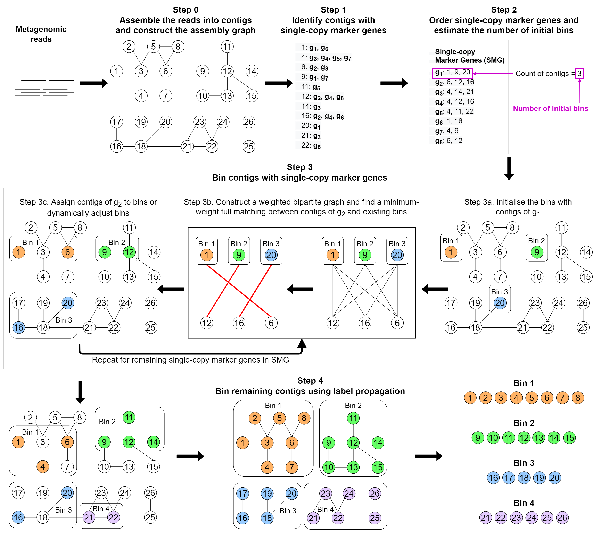

# Workflow

The overall workflow of MetaCoAG is shown below.

The assembly graph with contigs are provided as inputs to MetaCoAG. MetaCoAG first identifies a list of contigs that contain each single-copy marker gene. MetaCoAG further counts the number of contigs containing each single-copy marker gene and estimates the initial number of bins. Next, MetaCoAG applies a graph-matching algorithm to assign contigs that contain single-copy marker genes into bins iteratively and adjust the number of bins dynamically. Then, MetaCoAG bins the remaining contigs using label propagation algorithms based on the assembly graph and performs a postprocessing step. Finally, MetaCoAG outputs the bins along with their corresponding contigs.